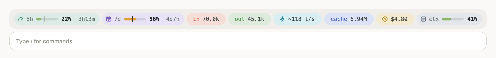
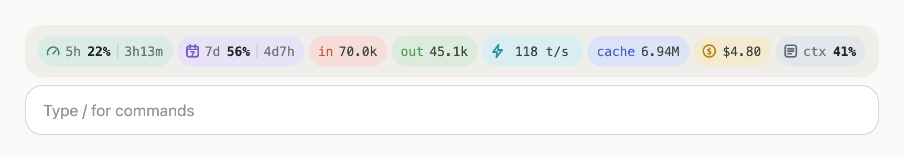
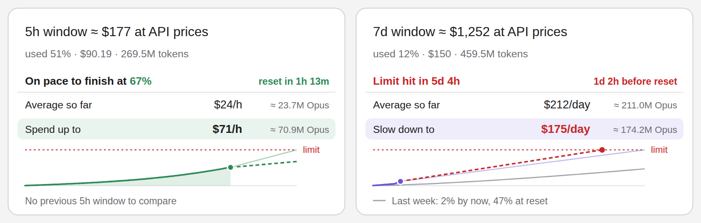
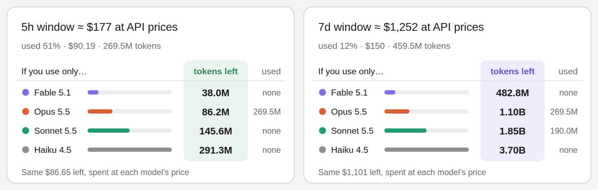

# usage-band

English | [中文](README.zh-CN.md)

A Claude Code **mod** that shows rate limits, tokens, live tokens per second, cost and context fill as a row of colored pills above the prompt, updated in real time. Press 📈 for window stats: what your 5h and 7d windows are worth at API prices, your pace, and how many tokens are left per model.

<picture>
  <source media="(prefers-color-scheme: dark)" srcset="docs/band-dark.png">
  
</picture>

## What it shows

| Pill | Meaning |
|---|---|
| **5h** | Share of the 5-hour rate limit used. The **tick** on the bar marks how much of the window's time has passed; a bar that runs past the tick means you are using it faster than time is passing. On the right: time until the window resets |
| **7d** | The 7-day limit, read the same way |
| **in** | Input tokens sent to the model this session (cache writes included) |
| **out** | Output tokens the model generated this session |
| **⚡** | Output speed in tokens per second. **Live while a response streams**, shown as `~118 t/s` (an estimate); exact once the response ends |
| **cache** | Tokens read from the prompt cache. Every request carries the whole conversation and the repeated part comes from the cache, so this number is the largest, but it costs about a tenth of regular input |
| **$** | Session cost so far, the same figure as `/cost` |
| **ctx** | Context fill, measured against your `autoCompactWindow` (auto-compact window) when one is set, otherwise against the model's context window |
| **📈** | Opens or closes the [window stats](#window-stats) above the pills. Shown only when you have 5h / 7d limits |

Bar colors: a rate limit turns red at 90% and amber when usage runs more than 15% ahead of time; context turns amber at 60% and red at 80%.

### Fits any width

The pills always stay on one line. As the window narrows, they shrink step by step: shorter bars → no clock icon and compact times → a smaller font → no bars. They come back as the window widens.

<picture>
  <source media="(prefers-color-scheme: dark)" srcset="docs/band-narrow-dark.png">
  
</picture>

### Window stats

Press **📈** at the end of the pills (or run `/usage-band stats`) to open two cards above them, one per rate-limit window. They answer how much the window is worth and how fast you can spend it:

<picture>
  <source media="(prefers-color-scheme: dark)" srcset="docs/stats-chart-dark.png">
  
</picture>

- **≈ $177 at API prices**: what the whole window is worth, estimated as the dollars spent in it (at API list prices, the same figure as `/cost`) divided by the share of the limit they used.
- **On pace to finish at 67%** or **Limit hit in 5d 0h**: where the window ends up at your average pace so far.
- **Average so far** and **Spend up to** / **Slow down to**: your rate so far, and the rate that lands exactly on the limit at the reset, per hour for 5h and per day for 7d. **≈ 196M Opus** is that rate in tokens of the model you use most, at your usual mix of input, output and cache.
- **The chart**: usage over the window (solid), your pace projected to the reset (dashed), the budget line to the limit (faint), and in gray the previous window at the same point in its time ("Last week: 7% by now, 47% at reset").

**By model** shows what is left of each window if you spent it all on one model: the same dollars left, divided by each model's price at your token mix. The **used** column is how many tokens of each model the window has seen.

<picture>
  <source media="(prefers-color-scheme: dark)" srcset="docs/stats-model-dark.png">
  
</picture>

**◐** cycles the colors between following the system, light and dark (the cards and pills are drawn as images, so "auto" follows your OS, not the app). The two cards always sit side by side and scale down with the band. In the terminal the same figures show as two lines of text.

How the numbers are made:

- The mod writes every request (model, tokens, cost) to a small ledger in its own store, one per session, so **all your Claude Code sessions on this machine count toward the windows they share**. Entries older than 8 days are dropped.
- **It starts counting when you install it.** A window that began earlier shows `tracked 2h 10m` and is measured from the first reading after that; until its percentage has moved about 1%, the card shows your pace in points of the limit (`19%/day`) instead of dollars. The next window is fully tracked.
- **Usage outside Claude Code on this machine** (claude.ai, the apps, another computer) moves the percentage but not the ledger, so it makes the dollar value read low.
- The previous-window comparison appears once the mod has watched a full window.
- Model prices (per million tokens, input / output / cache read): Fable 5.1 $10 / $50 / $0.25, Opus 5.5 $4 / $20 / $0.20, Sonnet 5.5 $2 / $10 / $0.20, Haiku 4.5 $1 / $5 / $0.10; cache writes at 1.25× input. They live in `hooks/prices.ts`.

### Status line mode

If you would rather not have the band above the prompt, switch to a single line of plain text on the status line below it:

```
5h ▰▱▱▱▱ 22% ↻3h13m  ·  7d ▰▰▰▱▱ 56% ↻4d7h  ·  in 70.0k  out 45.1k  ⚡~118 t/s  cache 6.94M  ·  $4.80  ·  ctx ▰▰▱▱▱ 41%
```

## Install

Requires **Claude Code v2.1.287 or later**, in the terminal (`claude`) or the Code tab of the Claude desktop app. Mods are on by default; check your version with `claude --version`.

In your shell:

```bash
claude plugin marketplace add iluolSNS/claude-code-usage-band
```

```bash
claude plugin install usage-band@cyan-mods
```

Or, inside a Claude Code session, run `/plugin install usage-band@cyan-mods`. Start a new session to see it, or run `/reload-plugins` in one that is already open.

### Update

```bash
claude plugin marketplace update cyan-mods
```

```bash
claude plugin update usage-band@cyan-mods
```

### Uninstall

```bash
claude plugin uninstall usage-band@cyan-mods
```

## Usage

| Command | What it does |
|---|---|
| `/usage-band` | Toggle between the pills and the status line |
| `/usage-band band` | Show the pills above the prompt |
| `/usage-band status` | Show the status line below the prompt |
| `/usage-band stats` | Open or close the window stats above the pills (same as 📈) |

Your choices (display mode, stats open, view, colors) are remembered across sessions. You can switch while Claude is responding.

## Notes

- **It uses no tokens and costs nothing.** The mod never calls a model or makes a network request: it reads figures Claude Code already keeps and draws them locally.
- **Where the numbers come from:** limits, cost and context come from Claude Code's own accounting, the same as the status line, `/cost` and `/context`. in/out/cache are summed by the mod after each request, subagents included; ⚡ speed counts the main conversation only.
- **Token counts start when the mod loads** and start over from 0 after a resumed session; cost and limits are unaffected.
- **5h / 7d limits** appear only when you sign in with a Claude subscription; with API-key billing those two pills are hidden.
- **Live speed is an estimate:** while a response streams the real token count isn't available yet, so the mod divides the characters so far by a characters-per-token ratio. That ratio is recalibrated from every finished response, so it gets more accurate after a few replies.
- The gray frame around the band belongs to the desktop app; a mod can't remove it.
- The pills show in the terminal and the desktop app only, not in the VS Code extension, `claude -p` or cloud sessions.

### What this mod can reach

A mod runs inside Claude Code with your permissions. `claude plugin validate` lists the calls a mod makes before you install it. This one uses only:

```
$.session.usage   read usage, cost, limits and context
$.session.id      name this session's ledger
$.clock           timing and periodic refresh
$.state / $.store keep running totals, the request ledger, limit readings and your choices
$.ui              draw the band, the stats cards and the status line
$.command         register the /usage-band command
```

No file access, no network requests, no processes.

## Layout

```
.claude-plugin/marketplace.json   marketplace manifest (cyan-mods)
plugins/usage-band/
├── .claude-plugin/plugin.json    plugin manifest
├── hooks/hooks.json              points to the hooks module
├── hooks/register.tsx            the hooks: band, status line, ledger, stats panel
├── hooks/stats.ts                window math: value, pace, rates, curves
├── hooks/cards.ts                the stats cards as SVG
├── hooks/prices.ts               model prices
├── hooks/format.ts               number and theme helpers
├── tests/                        claude plugin test
└── types/index.d.ts              state type contract
docs/                             screenshots
CHANGELOG.md                      release notes
```

## Changelog

See [CHANGELOG.md](CHANGELOG.md) and the [releases](https://github.com/iluolSNS/claude-code-usage-band/releases).

## License

[MIT](LICENSE)
